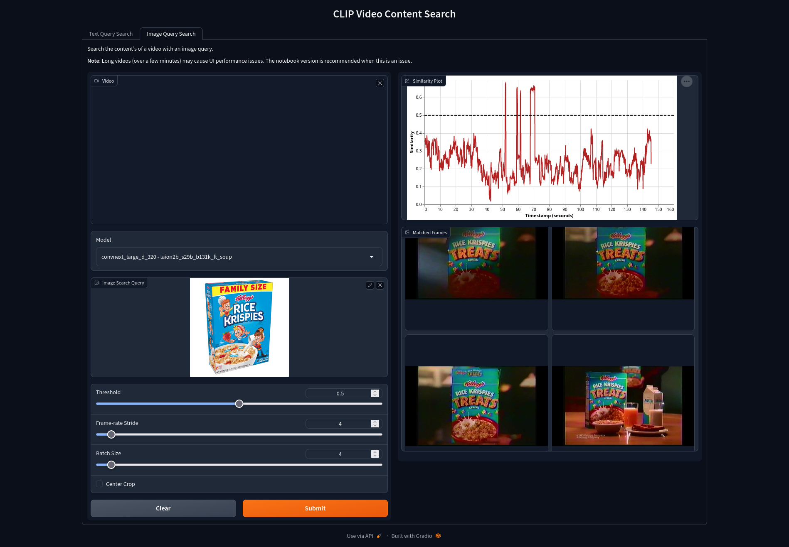

# Video Content Search

An application for searching videos to find frames that match a text or image query. This application utilizes ConvNext CLIP models from [OpenCLIP](https://github.com/mlfoundations/open_clip) to compare video frames with the feature representation of a user text or image query.

## Requirements
- Python 3.8+
- `pip install -r requirements`

## Usage
#### Web App
The application is available in the Hugging Face Space [here](https://huggingface.co/spaces/bwconrad/video-content-search).

Or you can run it locally by doing the following:
1. Run `python video-search-app.py` and open the given URL in a browser. 
2. Select either the "Text Query Search" or "Image Query Search" tab.
3. Upload your video and write a text query or upload a query image.
4. Adjust the parameters and click submit.

- __Note__: The web app can have performance issues with long videos (more than a few minutes). Instead use the notebook for longer videos.

#### Notebook
[`video-search-notebook.ipynb`](video-search-notebook.ipynb) provides an alternate UI with a few extra features.
